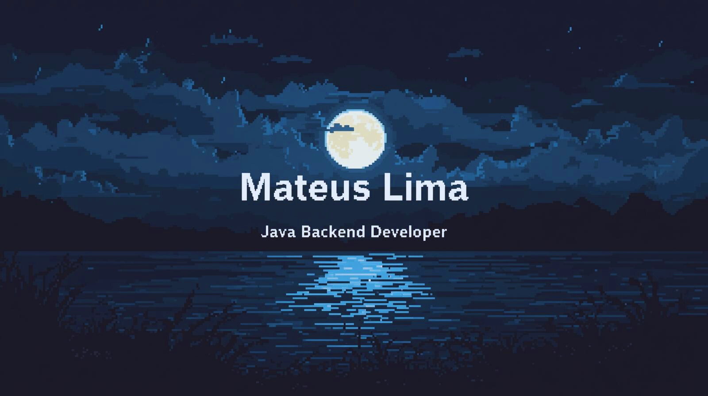

  
  
   

  

  

 

<table width="100%" cellpadding="10"
       style="border:none; border-collapse:collapse;">
  <tr>
    <td width="60%" valign="top"
        style="padding:12px; border:none;">
      <h3>⚡ Deixa eu me apresentar</h3>
      

        Sou estudante de <b>Sistemas de Informação</b> (5º semestre) e
        Estagiário no <b>Ministério das Comunicações</b>. Meu foco é o
        desenvolvimento Backend, unindo a robustez do Java com a
        inteligência de dados.
          
        Minha jornada pessoal me ensinou que <b>resiliência e disciplina</b>
        são tão importantes quanto um código limpo. Após superar um
        transplante de medula, trago para a tecnologia a mesma paciência
        estratégica que tive na vida: depurar problemas complexos até
        encontrar a solução.
         
      

    </td>
    <td width="40%" valign="top" align="center" style="border:none;">
      <h3>🛠️ Arsenal Técnico</h3>
      

          
          
          
          
          
          
          
                    
          
          
          
          
          
          
          
          
          
          
          
          
          
          
          
        </a>
      

    </td>
  </tr>
</table>

 

  <picture>
    <source media="(prefers-color-scheme: dark)" srcset="https://raw.githubusercontent.com/MateusLima909/MateusLima909/output/pacman-contribution-graph-dark.svg">
    <source media="(prefers-color-scheme: light)" srcset="https://raw.githubusercontent.com/MateusLima909/MateusLima909/output/pacman-contribution-graph.svg">
    
  </picture>

  

  
  
  

    <h3>🚀 O que estou fazendo agora?</h3>
    <ul>
       🏛 <b>Atualmente:</b> Otimizando processos e analisando dados no Ministério das Comunicações.    
      ☕ <b>Foco Técnico:</b> Aprofundando em Java (Spring Boot) e Arquitetura de Software.</li>    
      🤖 <b>Explorando:</b> Inteligência Artificial e NLP com Python (Veja meu projeto de <a href="https://github.com/MateusLima909/desafio-autou">Classificador de Emails com IA</a>).   
      🥁 <b>Hobby:</b> Baterista e guitarrista nas horas vagas (Eu tento).</li>  
    </ul>
  

   

 

  

  <h3>📊 Minha Produtividade</h3>
   
  

    
    
  

   
   

  

  <h3>🏆 Projetos em Destaque</h3>
  <table align="center">
    <tr>
      <td width="50%" align="center">
        
      </td>
      <td width="50%" align="center">
        
      </td>
    </tr>
    <tr>
      <td align="center">
        <b>TaskMaster Pro (Kanban)</b> 
        Java Puro (JDBC) • Sem ORM • Docker
      </td>
      <td align="center">
        <b>Catálogo de Microsserviços</b> 
        Spring Cloud • Gateway • Eureka
      </td>
    </tr>
  </table>

 

  
  

  

