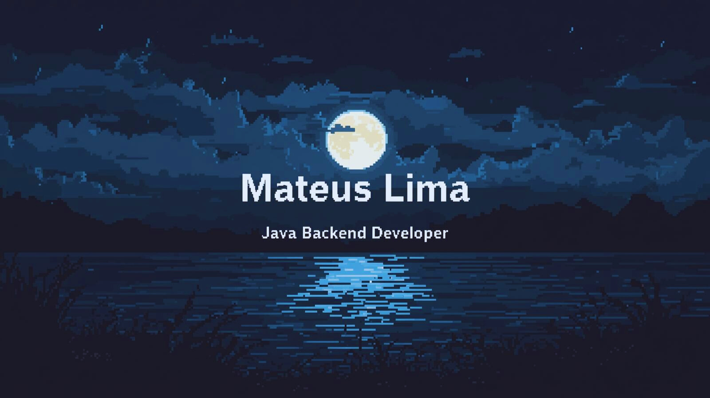

  
  
   

 

  

 

<table width="100%" cellpadding="10"
       style="border:none; border-collapse:collapse;">
  <tr>
    <td width="60%" valign="top"
        style="padding:12px; border:none;">
      <h3>⚡ Deixa eu me apresentar</h3>
      

        Sou estudante de <b>Sistemas de Informação</b> (6º semestre) e
        Estagiário no <b>Ministério das Comunicações</b>. Meu foco é o
        desenvolvimento Backend, unindo a robustez do Java com a
        inteligência de dados.
          
        Minha jornada pessoal me ensinou que <b>resiliência e disciplina</b>
        são tão importantes quanto um código limpo. Após superar um
        transplante de medula, trago para a tecnologia a mesma paciência
        estratégica que tive na vida: depurar problemas complexos até
        encontrar a solução.
         
         
      

    </td>
    <td width="50%" valign="top" align="center" style="border:none;">
      <h3>🛠️ Arsenal Técnico</h3>
      

        
         
        
      

    </td>
  </tr>
</table>

 

  <picture>
    <source media="(prefers-color-scheme: dark)" srcset="https://raw.githubusercontent.com/MateusLima909/MateusLima909/output/pacman-contribution-graph-dark.svg">
    <source media="(prefers-color-scheme: light)" srcset="https://raw.githubusercontent.com/MateusLima909/MateusLima909/output/pacman-contribution-graph.svg">
    
  </picture>

  

 

<table width="100%" cellpadding="10" style="border-collapse:collapse; border:0;"">
  <tr style="border:0;">
    <td width="40%" valign="middle" style="border:0; background-color:#0d1117;">
      
    </td>
    <td width="70%" style="border:none;">
      <h3>🚀 O que estou fazendo agora?</h3>
       
      

        🏛 <b>Atualmente:</b> Otimizando processos e analisando dados no <b>Ministério das Comunicações.</b>
          
        ☕ <b>Foco Técnico:</b> Aprofundando em Java (Spring Boot) e Arquitetura de Software.
          
        🤖 <b>Explorando:</b> Inteligência Artificial e NLP com Python 
        (Veja meu projeto de 
        <a href="https://github.com/MateusLima909/email-classifier">Classificador de Emails com IA</a>).
          
        🥁 <b>Hobby:</b> Baterista e guitarrista nas horas vagas (Eu tento).
      

    </td>
  </tr>
</table>

 

  

<h3 align="center">📊 Minha Produtividade</h3>

<table align="center">
  <tr>
    <td>
      
    </td>
    <td>
      
    </td>
  </tr>
</table>

   

  

  <h3>🏆 Projetos em Destaque</h3>
  <table align="center">
    <tr>
      <td width="50%" align="center">
        
      </td>
      <td width="50%" align="center">
        
      </td>
    </tr>
    <tr>
      <td align="center">
        <b>Classificador de Emails com IA</b> 
        Python • Gemini API • NLP
      </td>
      <td align="center">
        <b>Catálogo de Microsserviços</b> 
        Spring Cloud • Gateway • Eureka
      </td>
    </tr>
  </table>

 
 

  

