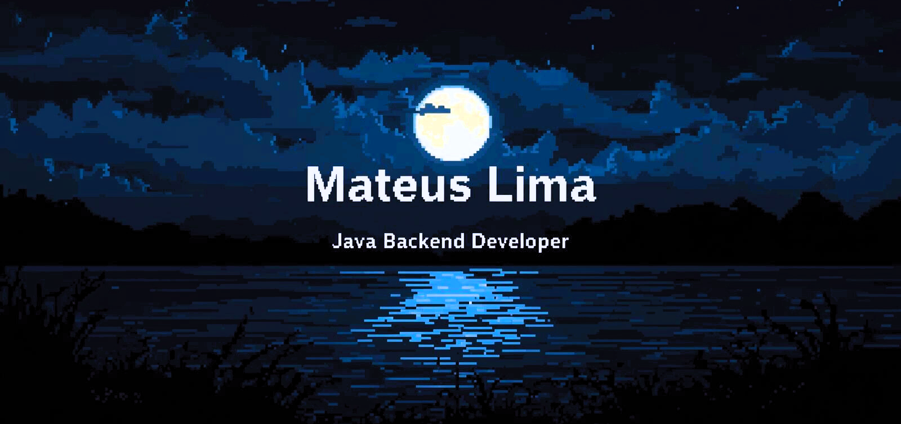

  
  
   

 

  

 

<table width="100%" cellpadding="10"
       style="border:none; border-collapse:collapse;">
  <tr>
  <td width="60%" valign="top" style="padding:12px; border:none;">
    <h3>⚡ Deixa eu me apresentar</h3>
    

      Sou estudante de <b>Sistemas de Informação</b> e atualmente atuo como
      estagiário no <b>Ministério das Comunicações</b>.
      Tenho interesse principalmente em <b>desenvolvimento Backend,
      dados e automação</b>, utilizando Java, Spring Boot, Python e SQL
      para transformar problemas reais em soluções práticas.
        
      Ao longo da graduação, venho desenvolvendo projetos envolvendo
      <b>APIs REST, microsserviços, bancos de dados, inteligência artificial,
      análise de dados e desenvolvimento web</b>.
      Gosto de entender como as coisas funcionam por trás do código e
      transformar conhecimento em projetos que possam ser utilizados
      na prática.
        
      Estou constantemente buscando evoluir, aprender novas tecnologias
      e construir uma base sólida para minha carreira em tecnologia.
    

  </td>
    <td width="50%" valign="top" align="center" style="border:none;">
      <h3>🛠️ Arsenal Técnico</h3>
      

         
      

    </td>
  </tr>
</table>

 

  <picture>
    <source media="(prefers-color-scheme: dark)" srcset="https://raw.githubusercontent.com/MateusLima909/MateusLima909/output/pacman-contribution-graph-dark.svg">
    <source media="(prefers-color-scheme: light)" srcset="https://raw.githubusercontent.com/MateusLima909/MateusLima909/output/pacman-contribution-graph.svg">
    
  </picture>

  

 

<table width="100%" cellpadding="10" style="border-collapse:collapse; border:0;">
  <tr style="border:0;">
    <td width="40%" valign="middle" style="border:0; background-color:#0d1117;">
      
    </td>
    <td width="70%" style="border:none;">
      <h3>🚀 O que estou fazendo agora?</h3>
       
      

        🏛 <b>Atualmente:</b> Estagiário no <b>Ministério das Comunicações</b>,
        atuando com processos, organização e restrição de dados.
          
        ☕ <b>Foco Técnico:</b> Aprofundando meus conhecimentos em
        <b>Java, Spring Boot, SQL e Arquitetura de Software</b>.
          
        📊 <b>Dados & Automação:</b> Desenvolvendo soluções com
        <b>Python, Power BI e APIs</b> para transformar dados em informações
        úteis e automatizar tarefas.
          
        🤖 <b>Explorando:</b> Inteligência Artificial, NLP e aplicações
        de LLMs em projetos práticos.
          
        🥁 <b>Hobby:</b> Baterista e guitarrista nas horas vagas
        (Tentando pelo menos).
      

    </td>
  </tr>
</table>

 

  

  <h3>🏆 Projetos em Destaque</h3>
  <table align="center">
    

      <picture>
        <source media="(prefers-color-scheme: light)" srcset="https://www.gitskins.com/api/section/projects?username=MateusLima909&theme=neon&mode=light" />
        
      </picture>
    

  </table>

   
   
  

  

    
  

